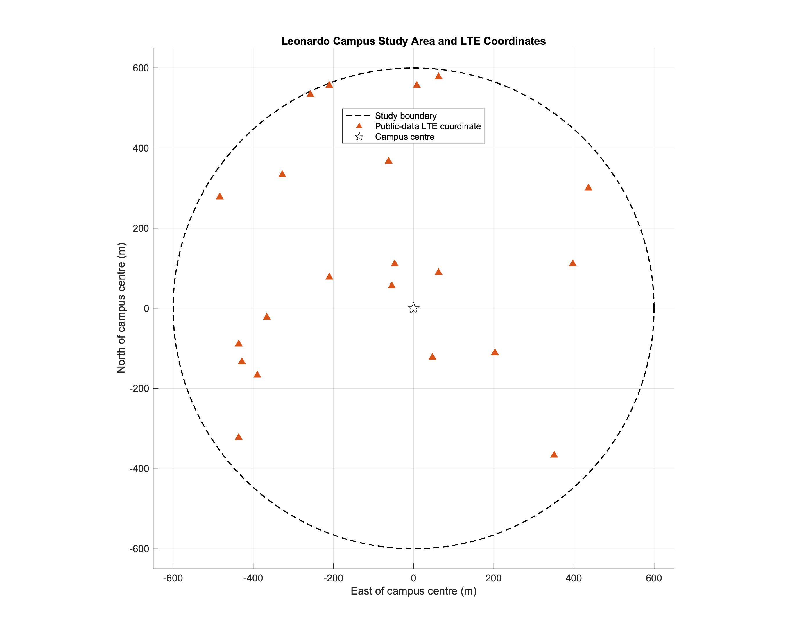
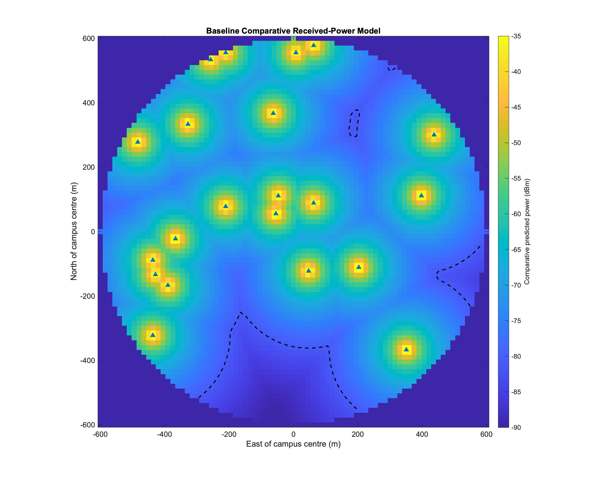
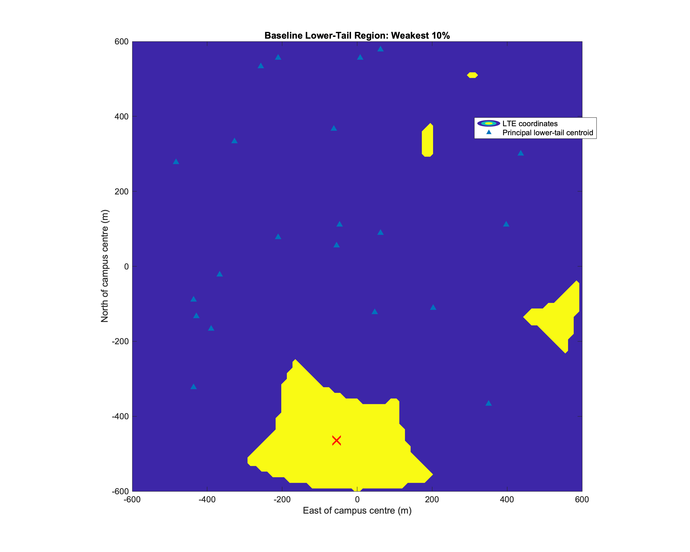
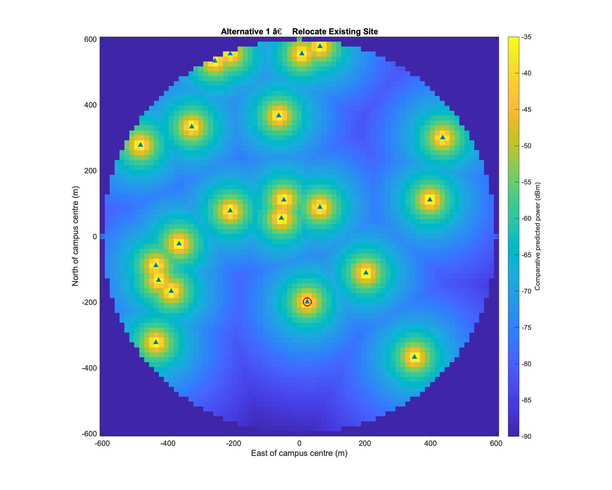
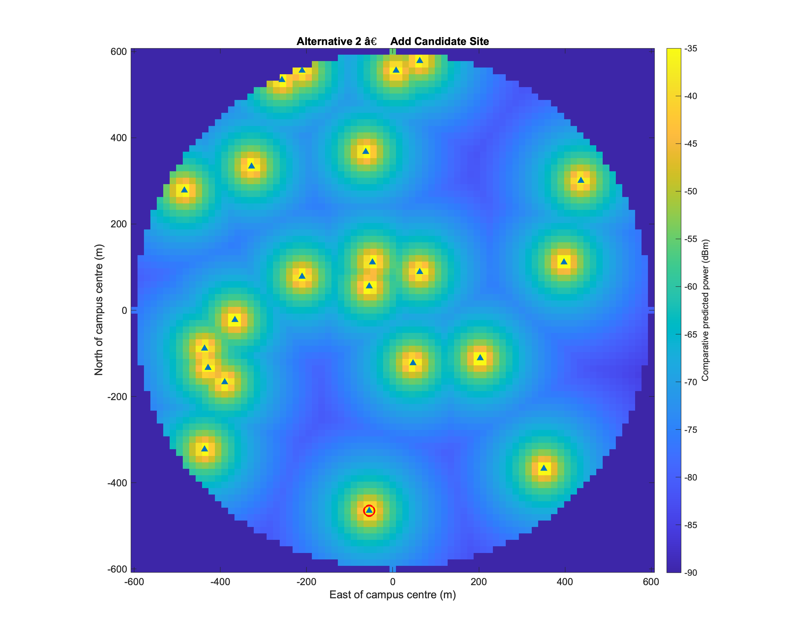
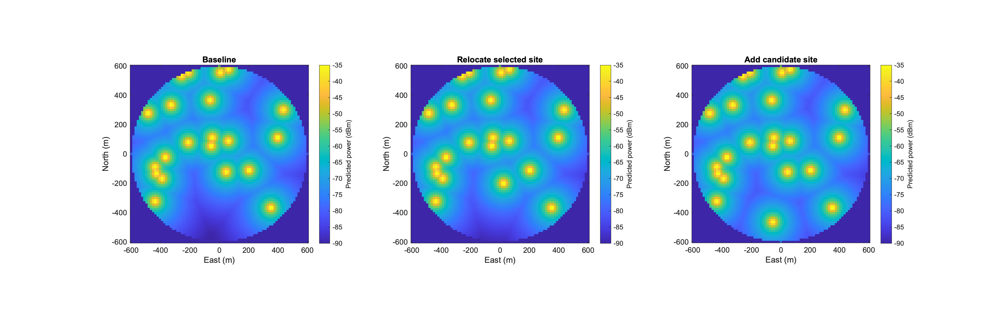
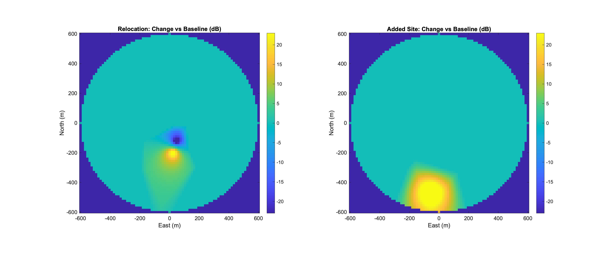
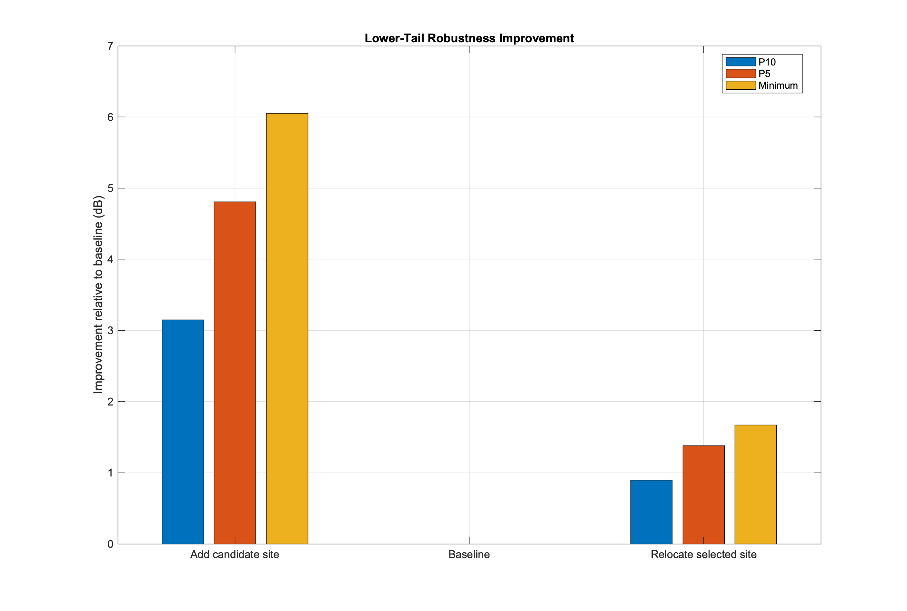
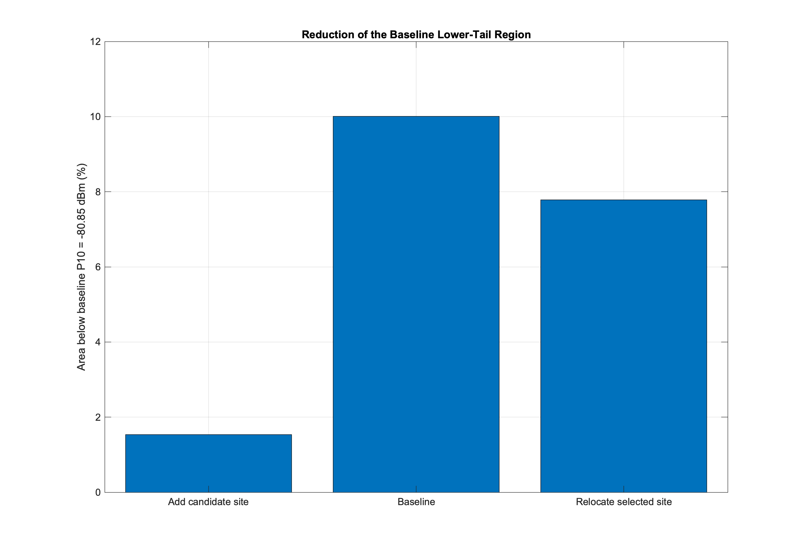
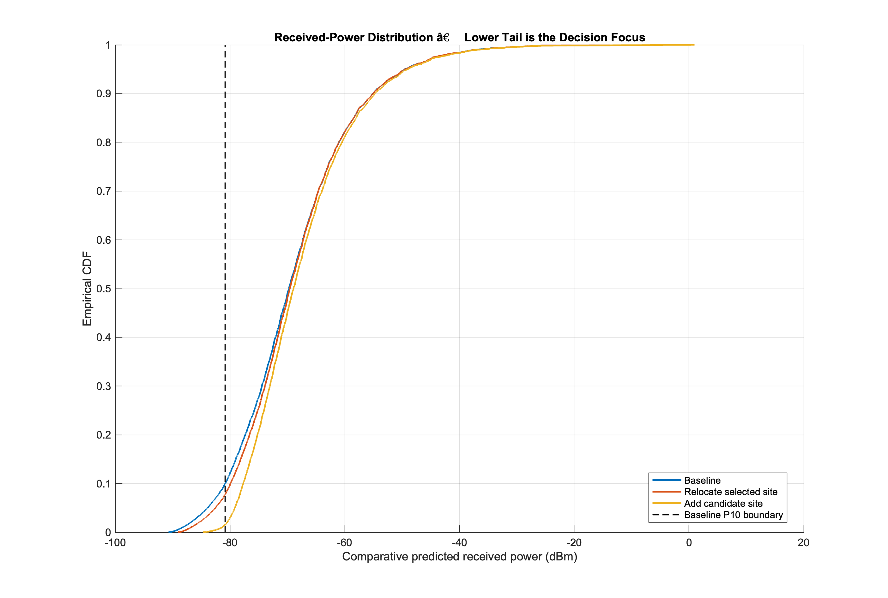

# Leonardo Campus RF Coverage Planning Case Study

## Executive summary

This repository is an independent RF engineering case study for the Leonardo / Città Studi area of Milan.

The project started as a 3-D urban propagation visualization using MATLAB, OpenStreetMap building geometry and OpenCellID-derived transmitter coordinates. It has been extended into a **client-style comparative planning study** that asks:

> Where is the weakest part of the baseline modelled service area, and which practical network change most improves lower-tail coverage?

The quantitative comparison evaluates:

1. the baseline public-data transmitter geometry;
2. relocating one existing site toward the principal weak region;
3. adding one candidate site in the principal weak region.

The recommendation is based on calculated lower-tail KPIs rather than visual inspection alone.

> **Important:** this is a comparative planning model, not an operator-certified coverage prediction. Absolute transmitter engineering parameters and field calibration data are not available.

---

## Engineering question

A planning client does not only need a heatmap. The decision problem is:

- Where is the weakest portion of the baseline service area?
- How severe is the lower tail of predicted received power?
- Can an existing site be repositioned to improve it?
- Does adding another site provide materially greater benefit?
- Is the incremental gain large enough to justify the implementation burden?

The analysis therefore follows:

**inputs and assumptions → baseline → lower-tail diagnosis → controlled alternatives → KPI comparison → engineering recommendation**

---

## Study area

The study covers a **600 m radius** around the Leonardo campus / Città Studi area in Milan.

The transmitter coordinates are derived from public OpenCellID data. The quantitative comparison uses **LTE records only** so that different radio technologies are not treated as if they shared identical carrier frequency and propagation assumptions.



---

## Input data

### Public-data inputs

The model uses:

- transmitter latitude;
- transmitter longitude;
- radio-technology label.

### Engineering assumptions

OpenCellID does not provide enough verified information to reconstruct an operator radio design. The following parameters are therefore explicit assumptions:

| Parameter | Value used |
|---|---:|
| Radio layer | LTE |
| Carrier frequency | 1800 MHz |
| Transmitter power | 10 W / 40 dBm |
| Antenna gain | 0 dBi |
| Antenna height | 25 m |
| Receiver height | 1.5 m |
| Path-loss exponent | 3.5 |
| Study radius | 600 m |
| Grid resolution | 15 m |

Antenna and receiver heights are documented as modelling assumptions but are not explicitly used by the simplified R2019b path-loss equation.

---

## Two modelling layers

### 1. Original 3-D urban visualization

The original project uses MATLAB `siteviewer`, OSM building geometry and a ray-tracing propagation workflow to visualize coverage around the campus.

That part of the project demonstrates:

- 3-D urban map construction;
- use of public transmitter coordinates;
- propagation visualization;
- ray-tracing workflow development.

The original code was developed against a newer MATLAB ray-tracing API.

### 2. Reproducible quantitative comparison

The current machine available for this case-study update runs MATLAB R2019b, which does not expose the newer `propagationModel("raytracing",...)` workflow.

Rather than substitute fake ray-tracing results, the quantitative scenario comparison uses a transparent **log-distance path-loss screening model**:

\[
P_r(d)=P_t+G_t-\left[PL(d_0)+10n\log_{10}\left(\frac{d}{d_0}\right)\right]
\]

with:

- \(d_0=1\) m;
- reference free-space loss calculated at 1800 MHz;
- \(n=3.5\) as an uncalibrated urban screening assumption;
- strongest predicted serving signal retained at each grid point.

This layer is used for **relative comparison**, not absolute coverage certification.

---

## Why the study uses a lower-tail metric

A fixed threshold such as -95 dBm would be misleading here because the simplified baseline model predicts the entire selected area above that value.

Therefore the engineering comparison is deliberately **baseline-relative**.

The weakest **10% of baseline grid points** defines the lower-tail planning region.

The baseline 10th-percentile value is:

**−80.85 dBm**

That threshold is then frozen and applied to every alternative scenario.

This answers a useful planning question:

> How much of the original weakest region remains weak after each intervention?

It avoids pretending that an arbitrary dBm value represents a universal LTE service limit.

---

## Baseline assessment

The baseline model produces the received-power distribution using the existing public-data transmitter geometry.



### Baseline KPIs

| KPI | Baseline |
|---|---:|
| Median predicted power | −69.75 dBm |
| 10th-percentile power | −80.85 dBm |
| 5th-percentile power | −83.95 dBm |
| Minimum predicted power | −90.72 dBm |
| Area below baseline-P10 boundary | `10% by definition` |

The lower tail is more informative than the median because the engineering objective is to improve the weakest locations rather than make already-strong areas stronger.

---

## Principal lower-tail region

The weakest 10% of baseline grid cells are grouped into connected spatial regions.

The largest connected region becomes the **principal planning target**.



The script exports its centroid and area to:

```text
outputs/baseline_lower_tail_zones.csv
```

This is a model-derived planning target. It is not claimed to be a measured dead zone.

---

## Alternative 1 — relocate one existing site

The existing LTE coordinate nearest the principal lower-tail centroid is selected.

That site is moved by up to **80 m toward the target region**, with all RF assumptions held constant.



This asks whether geometry optimization of existing infrastructure can improve lower-tail coverage without adding a site.

### Main trade-off

A real relocation decision would also require:

- structural feasibility;
- lease/site availability;
- backhaul;
- power;
- permitting;
- interference review.

Those are outside this simulation.

---

## Alternative 2 — add one candidate site

A candidate site is placed at the centroid of the principal baseline lower-tail region using the same assumed carrier and power as the baseline sites.



This is intentionally a **planning candidate**, not a claim that a real base station can be installed at that exact coordinate.

### Main trade-off

A new site generally carries much higher implementation cost than adjusting an existing one because it introduces new:

- site acquisition;
- civil works;
- backhaul;
- power;
- permitting;
- network integration.

---

## Scenario comparison

All scenarios use identical model parameters except for the explicitly changed site geometry.



The improvement maps show the predicted change relative to the baseline.



---

## Quantitative results

The decision KPIs are:

- median received power;
- P10 received power;
- P5 received power;
- minimum predicted power;
- area remaining below the fixed **baseline-P10 boundary**;
- improvement of P10, P5 and minimum power relative to baseline.

| Scenario | P10 | P5 | Minimum | Area below baseline-P10 | Main trade-off |
|---|---:|---:|---:|---:|---|
| Baseline | −80.85 dBm | −83.95 dBm | −90.72 dBm | 10.01% (113,175 m²) | Existing assumed configuration |
| Relocate selected site | −79.96 dBm | −82.57 dBm | −89.05 dBm | 7.78% (87,975 m²) | Relocation feasibility |
| Add candidate site | −77.70 dBm | −79.14 dBm | −84.67 dBm | 1.53% (17,325 m²) | New-site deployment burden |







---

## Recommendation

**Technical performance leader: Add candidate site**

The dominant baseline lower-tail cluster covers approximately **96,975 m²** and is centred about **55 m west and 465 m south** of the campus centre. This model-derived weak region is used to define the candidate intervention location.

Relocating the selected existing site improves P10 by **0.89 dB**, P5 by **1.38 dB**, and the minimum predicted power by **1.67 dB**. It reduces the area below the original baseline-P10 boundary from **113,175 m² to 87,975 m²**, a reduction of approximately **22.3%**.

Adding the candidate site produces the stronger lower-tail improvement: P10 increases by **3.15 dB**, P5 by **4.81 dB**, and minimum predicted power by **6.05 dB**. The area below the baseline-P10 boundary falls to **17,325 m²**, approximately **84.7% less than baseline**.

Under the assumptions of this comparative model, the added-site scenario is therefore the technical performance leader. A commercial deployment decision would still need to weigh this RF improvement against site acquisition, permitting, power, backhaul, interference and deployment cost.


The technical recommendation is driven primarily by **lower-tail robustness**, because improving the weakest service locations is the objective of this study.

The cheapest implementation is not automatically the technical winner. In a real engagement, the final client recommendation would combine these RF results with CAPEX/OPEX, site feasibility, interference, capacity and deployment constraints.

---

## Engineering interpretation

The important result is not simply whether the map becomes “more yellow.”

The consulting value is the decision chain:

1. establish a reproducible baseline;
2. identify the weakest part of the baseline distribution;
3. locate the principal spatial lower-tail region;
4. select alternatives because of that observed problem;
5. hold all unrelated parameters constant;
6. quantify the lower-tail change;
7. separate technical benefit from implementation trade-offs.

This is the same reasoning structure that can be applied to a higher-fidelity operator model when verified antenna data and field measurements are available.

---

## Client relevance

The workflow can support early-stage RF planning questions such as:

- Which area deserves detailed investigation first?
- Is an existing-site geometry change worth evaluating?
- Where would an additional site provide the strongest marginal benefit?
- How much does each alternative improve worst-case or lower-tail performance?
- Is the improvement concentrated where it is needed, or merely raising already-strong locations?

A commercial engagement would typically use this screening analysis before committing time and cost to detailed propagation modelling or field measurement.

---

## Assumptions and limitations

The following limitations are material and must be considered when interpreting the results.

### Public-data coordinate accuracy

OpenCellID-derived coordinates can contain positioning error. They are treated as approximate public-data site coordinates, not survey-grade antenna locations.

### Unknown transmitter power

The simulation assumes **10 W / 40 dBm** per transmitter. This is not claimed to be the operator's real configured power.

### Unknown antenna height

A height of **25 m** is documented as an assumption. Verified site heights are not available.

### Unknown antenna pattern, azimuth and downtilt

The quantitative model uses isotropic-equivalent gain and does not model sector patterns, electrical/mechanical tilt or verified antenna orientation.

### Simplified propagation model

The R2019b quantitative comparison does not model deterministic building blockage, diffraction, reflection or penetration.

### Building geometry and materials

The repository retains OSM building geometry used by the original 3-D visualization, but building material parameters are not calibrated.

### Spatial resolution

The quantitative analysis uses a **15 m grid**, so small-scale fading and local street-level variations are not represented.

### No field calibration

No drive-test, walk-test or operator measurement data is used to calibrate the quantitative model.

### Received power is not user throughput

Actual user performance also depends on:

- SINR;
- interference;
- network load;
- bandwidth;
- scheduler behaviour;
- modulation and coding;
- device capability;
- indoor penetration.

### Comparative model, not certified prediction

The results should be interpreted as **relative scenario-screening results**.

They are not certified coverage predictions and should not be presented as measured network performance.

---

## Reproduction

### MATLAB

The quantitative script is compatible with MATLAB R2019b.

From the repository root:

```matlab
leonardo_coverage_case_study
```

The script searches for the transmitter CSV in:

```text
data/Milan_towers.csv
map/Milan_towers.csv
Milan_towers.csv
```

---

## Generated outputs

```text
outputs/
├── 01_study_area_transmitters.png
├── 02_baseline_coverage.png
├── 03_baseline_lower_tail_region.png
├── 04_alternative_relocation.png
├── 05_alternative_added_site.png
├── 06_scenario_comparison.png
├── 07_improvement_maps.png
├── 08_lower_tail_kpi_comparison.png
├── 09_lower_tail_area_comparison.png
├── 10_received_power_cdf.png
├── 11_recommended_configuration.png
├── scenario_kpis.csv
├── baseline_lower_tail_zones.csv
├── scenario_locations.csv
├── transmitters_used.csv
└── case_study_results.mat
```

---

## Repository structure

```text
Leonardo_campus_coverage/
├── README.md
├── .gitignore
├── leonardo_coverage_case_study.m
├── filter_milan.py
├── map.osm
├── data/
│   ├── Italy_towers.csv
│   └── Milan_towers.csv
└── outputs/
```

---

## Independent-project statement

This is an independently developed engineering portfolio case study.

It is **not** work performed for Politecnico di Milano, a mobile-network operator, OpenCellID, or any current or former employer.

No employer measurements, employer procedures, confidential client data, proprietary antenna data or imaginary field measurements are used.

---

## Key takeaway

The original project demonstrated urban RF propagation visualization.

The completed case study adds the part that matters in consulting:

> **identify the weak part of a baseline, compare controlled engineering alternatives, quantify the change, state the assumptions, and make a recommendation tied to evidence.**
